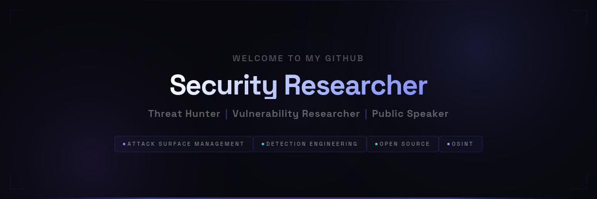

	

Rishi is a vulnerability researcher and threat intelligence specialist in London, working on detection research — Nuclei templates and internet-wide scans — cited or adopted by national cyber authorities and CERT teams.

### 🛠️ Open Source

- **ProjectDiscovery Pioneer** — authored 500+ Nuclei templates
- **OWASP Member** — Amass & Nettacker contributor
- Detection scripts adopted by national CERTs

### 🏆 Recognition & Media

- **Government & CERT** — cited or adopted by NCSC, CERT Polska, NIST/NVD, INCIBE, CIRCL, Cal-CSIC, Vietnam
- **Industry** — cited by SonicWall, Qualys, Censys, ReSecurity, Coalition, Intruder, BlackKite, Feedly, +more
- **Media** — GBHackers, CyberPress, lebigdata.fr

### 🎤 Talks

- **UK Parliament** — briefing on vuln research & supply chain security
- **DEF CON 34** — SE Village (x2 workshops) & Recon Village
- **DEF CON 33** — Red Team Village: DNS OSINT
- **Black Hat Sector** — Ghost in the Hiring Machine
- **OWASP London** — Salesloft Drift detection via DNS
- **BSides** — Budapest, Prague, Las Vegas & more

### 📝 Research & Blogs

- [Detecting OpenClaw Gateways over mDNS](https://rxerium.com/posts/hunting-exposed-openclaw-instances-with-nuclei/)
- [DNS OSINT Techniques](https://rxerium.com/posts/dns-osint-techniques/)
- [Internal Security Detection from an External Lens](https://rxerium.com/posts/internal-security-detection/)
- [Fishing for Phishing with Nuclei Templates](https://rxerium.com/posts/fishing-for-phishing-with-nuclei-templates/)

### 📫 Connect

- **Website**: [rxerium.com](https://rxerium.com)
- **X**: [@rxerium](https://x.com/rxerium)
- **Bluesky**: [@rxerium.com](https://bsky.app/profile/rxerium.com)
- **Mastodon**: [@rxerium@infosec.exchange](https://infosec.exchange/@rxerium)
- **PGP**: [public key](misc/email_PGP.md) — rishi@rxerium.com

	

