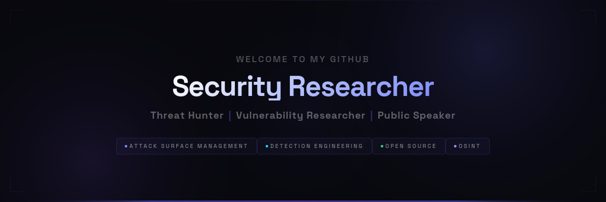

	

# Rishi — @rxerium

Vulnerability researcher and threat intelligence specialist in **London, UK** — **CTI at [The Shadowserver Foundation](https://www.shadowserver.org)** and part of the executive leadership of the **UK OSINT community**. Detection research recognised by governments across North America, Europe and Asia, and trusted by national cyber authorities and law enforcement.

Full profile: **[rxerium.com/about](https://rxerium.com/about/)**

<!-- SYNC:START -->
## 📊 At a glance

| | |
|---|---|
| 🛡️ Nuclei templates | **950+** authored · **530+** merged upstream · **73** covering CISA KEV |
| 🎤 Conference talks | **17** sessions across **8** countries · **2** workshops |
| 🏛️ Gov & CERT citations | **7** — NCSC (UK), CERT Polska, NIST/NVD, INCIBE (ES), CIRCL (LU), Cal-CSIC, Vietnam |
| 🐛 CVEs disclosed | **11** — **3** Critical (CVSS 9.8) · **8** High (CVSS 7.5) |

> 🔄 Stats auto-synced weekly from [rxerium.com/about](https://rxerium.com/about/) — the website is the source of truth.
<!-- SYNC:END -->

## 🛠️ Open source & projects

| Project | What it is |
|---|---|
| [rxerium-templates](https://github.com/rxerium/rxerium-templates) ⭐ | Open-source Nuclei detection templates for critical CVEs & zero-days — **950+** templates used worldwide |
| [CISA-KEV](https://github.com/rxerium/CISA-KEV) | Automated tracking of Nuclei template coverage against the CISA Known Exploited Vulnerabilities catalog |
| [cms-exploitation-campaign](https://github.com/rxerium/cms-exploitation-campaign) | Analysis of a large-scale CMS exploitation campaign (Jul 2026) |
| [ai-bot-ip-ranges](https://github.com/rxerium/ai-bot-ip-ranges) | Official IP ranges for AI bot crawlers, auto-updated weekly |
| [responsible-disclosure-email-gathering](https://github.com/rxerium/responsible-disclosure-email-gathering) | Workflow to gather responsible disclosure emails from given hosts |
| [OWASP Amass](https://github.com/owasp-amass/amass) | Contributor — in-depth attack surface mapping & asset discovery |

<!-- CVES:START -->
## 🐛 Disclosed CVEs

| CVE | Product | Impact | Severity |
|---|---|---|---|
| [CVE-2026-89026](https://nvd.nist.gov/vuln/detail/CVE-2026-89026) | Issabel Framework / Issabel PBX | Hardcoded JWT key leading to remote command execution, exploited in the wild | 🔴 Critical · 9.8 |
| [CVE-2023-54399](https://nvd.nist.gov/vuln/detail/CVE-2023-54399) | Hongjing e-HR | Unauthenticated SQL injection | 🔴 Critical · 9.8 |
| [CVE-2023-54400](https://nvd.nist.gov/vuln/detail/CVE-2023-54400) | Fumasoft Fumeng Cloud | Unauthenticated SQL injection | 🔴 Critical · 9.8 |
| [CVE-2024-58388](https://nvd.nist.gov/vuln/detail/CVE-2024-58388) | Sharp / Toshiba Tec MFPs | Local file inclusion via directory traversal | 🟠 High · 7.5 |
| [CVE-2024-58387](https://nvd.nist.gov/vuln/detail/CVE-2024-58387) | Inspur Haiyue HCM Cloud | Arbitrary file read | 🟠 High · 7.5 |
| [CVE-2023-54403](https://nvd.nist.gov/vuln/detail/CVE-2023-54403) | Yonyou U8 CRM | Arbitrary file read with authentication bypass | 🟠 High · 7.5 |
| [CVE-2023-54402](https://nvd.nist.gov/vuln/detail/CVE-2023-54402) | iDocView | SSRF leading to local file read | 🟠 High · 7.5 |
| [CVE-2021-48008](https://nvd.nist.gov/vuln/detail/CVE-2021-48008) | Chanjet CRM | Unauthenticated SQL injection | 🟠 High · 7.5 |
| [CVE-2019-25776](https://nvd.nist.gov/vuln/detail/CVE-2019-25776) | Weaver E-cology | Unauthenticated SQL injection | 🟠 High · 7.5 |
| [CVE-2017-20284](https://nvd.nist.gov/vuln/detail/CVE-2017-20284) | Caucho Resin | Path traversal file read | 🟠 High · 7.5 |
| [CVE-2015-20122](https://nvd.nist.gov/vuln/detail/CVE-2015-20122) | Seeyon A6 OA | Unauthenticated SQL injection | 🟠 High · 7.5 |

Full details: [rxerium.com/about/#cves](https://rxerium.com/about/#cves)
<!-- CVES:END -->

## 🎤 Speaking

Multi-time **DEF CON** speaker across the Red Team, Recon and Social Engineering Villages, plus the **BSides circuit**, **OWASP London**, and a briefing for the **UK government & policymakers**. Next up: **SecTor 2026, Toronto**.

| Circuit | Highlights |
|---|---|
| DEF CON Villages, Las Vegas | Red Team Village (DNS OSINT) · Recon Village · SE Village workshops (Zero Day Hire) · Amass workshop |
| BSides & community | Las Vegas · Cymru · Porto · Prague · Budapest (×2) · Luxembourg (×2) · Hack Glasgow · ElbSides Hamburg |
| Industry & policy | OWASP London · SecTor Toronto · UK Parliament briefing on supply-chain risk |

Full history: [rxerium.com/talks](https://rxerium.com/talks/)

## 🏆 Recognition

| Who | What |
|---|---|
| NCSC (UK Government) | Recognised detection script for GoAnywhere MFT exploitation ([CVE-2025-10035](https://nvd.nist.gov/vuln/detail/CVE-2025-10035)) |
| CERT Polska | Adopted detection scripts into Artemis tooling (CVE-2025-49113, CVE-2025-68461) |
| NIST / NVD | Featured detection script on the official CVE-2023-40000 advisory |
| INCIBE (ES) · CIRCL (LU) · Cal-CSIC · Gov. of Vietnam | Referenced/cited detection research in national guidance & advisories |
| BSides Las Vegas 2025 | 🏅 ProsVJoes CTF winner |

Industry citations: **SonicWall · Qualys · Censys · ReSecurity · Coalition** and more. Press: **GBHackers · The Hacker News · Cybersecurity News**. Podcasts/newsletters: **SANS Stormcast · SecurityIntel · Exploit Bulletin**.

## 📝 Research & writing

- [Detecting OpenClaw Gateways with Nuclei over mDNS](https://rxerium.com/posts/hunting-exposed-openclaw-instances-with-nuclei/) — Jan 2026
- [Salesloft Drift supply-chain detection through DNS OSINT](https://rxerium.com/posts/dns-osint-techniques/) — Dec 2025
- [Internal Security Detection from an External Lens](https://rxerium.com/posts/internal-security-detection/) — Jun 2025
- [Ethical Implications of OSINT in Personal Data Collection](https://www.osint.uk/content/ethical-implications-of-osint-in-personal-data-collection) — osint.uk
- [Fishing for Phishing with Nuclei Templates](https://projectdiscovery.io/blog/phishing-templates) — ProjectDiscovery
- [Community Spotlight interview](https://projectdiscovery.io/blog/community-spotlight-rishi-rxerium) — ProjectDiscovery

## 🧰 Focus

`vulnerability research` · `threat intelligence` · `detection engineering` · `OSINT` · `DNS OSINT` · `attack surface management` · `supply chain security` · `internet-wide scanning` · `phishing detection` · `honeypots` · `nuclei` · `amass` · `CVE / CVSS / EPSS` · `public speaking` · `mentoring`

## 📫 Connect

- **Website**: [rxerium.com](https://rxerium.com)
- **Email**: rishi@rxerium.com
- **X**: [@rxerium](https://x.com/rxerium)
- **Bluesky**: [@rxerium.com](https://bsky.app/profile/rxerium.com)
- **Mastodon**: [@rxerium@infosec.exchange](https://infosec.exchange/@rxerium)
- **PGP**: [public key](misc/email_PGP.md) — rishi@rxerium.com

	

